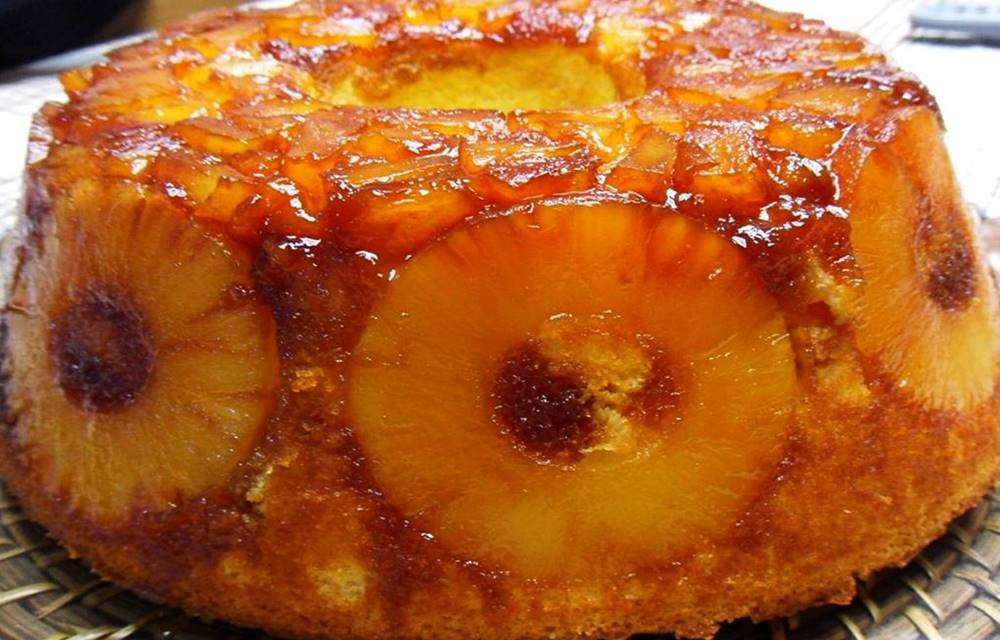

# BOLO DE ANANAS

 

## INGREDIENTES

* 400 gr de farinha com fermento
* 500 gr de acucar
* 6 ovos (Separar as claras e as gemas)
* 250 gr de manteiga
* 1 chavena de leite

 

## PREPARACAO

1. Caramelizar a forma 300 gr de acucar e um pouco de agua.
2. Untar a forma com manteiga
3. Por as rodelas a volta da forma e por fim por a massa do bolo
4. Por no forno a 350 graus F por +/- 60 minutos.

 

Category: Sweets | Subcategory: Cakes
