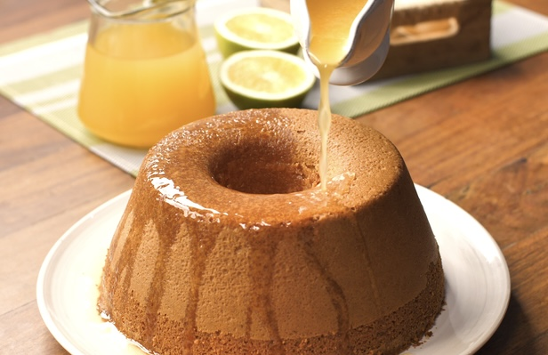

# BOLO DE LARANJA

 

## INGREDIENTES

* 500 gr de acucar
* 6 ovos
* 500 gr de farinha com fermento
* 1 pacote (250gr) de manteiga
* Sumo e raspa de 2 ou 3 laranjas

 

## PREPARACAO

1. Bate-se as gemas com o acucar
2. Adiciona-se a manteiga e o sumo de laranja aos poucos, sempre batendo.
3. Depois adiciona-se a farinha e evolver as claras em castelo.
4. Por no forno a 350 graus F por 60 mins.  
  

`NOTA: Com o bolo ainda quente, adicionar o sumo de 1 laranja.`

 
Category: Sweets | Subcategory: Cakes
